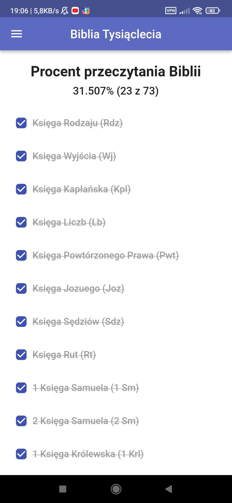

# Bible

A mobile Bible App.

## Features

- Reading the Bible
- Search in The Bible
- Percentage of Reading
- Saving Quotes/Verses

Cons:
- Only in Polish

  
Screenshots

  <!-- table with screenshots -->
  | Main Page | Book Page | Chapter Page |
  |:---------:|:---------:|:------------:|
  |  |  |  |

  | Search Page | Percentage Page | Qutoes Page |
  |:---------:|:---------:|:------------:|
  |  |  |  |
  
  | Dark Mode & Navigation Drawer |
  |:-----------------------------:|
  |  |

## Download

Download `.apk` in [releases](https://github.com/Zielin0/bibre/releases) tab.

## License

This project is under the [MIT](./LICENSE) License.